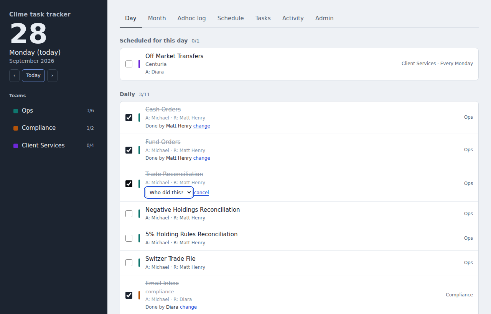
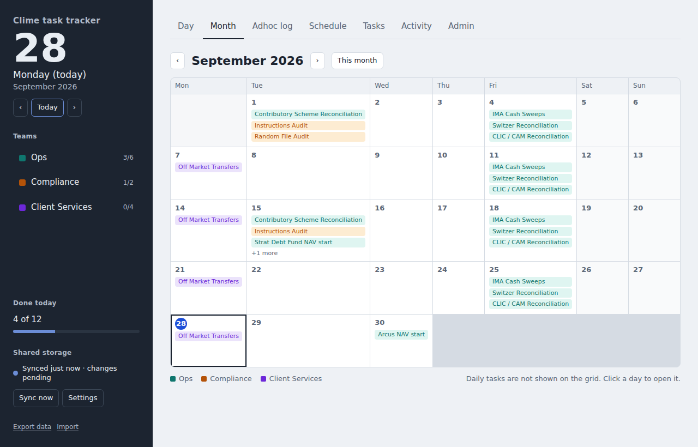
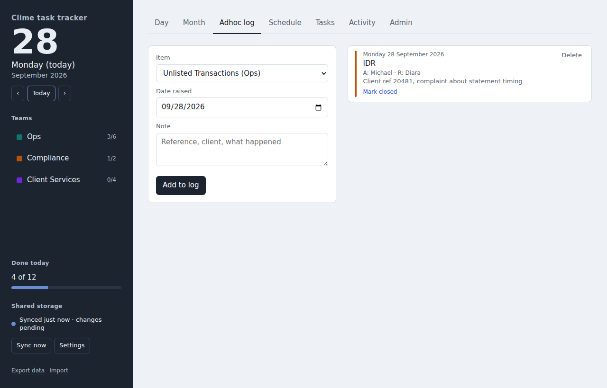
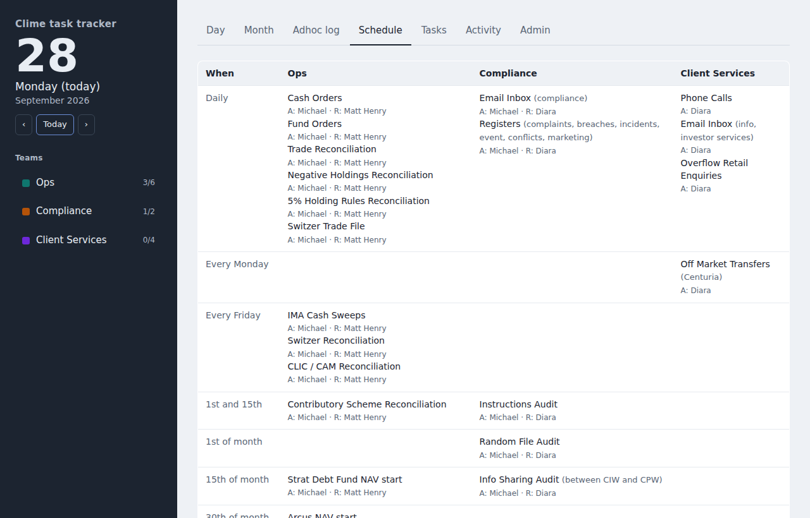
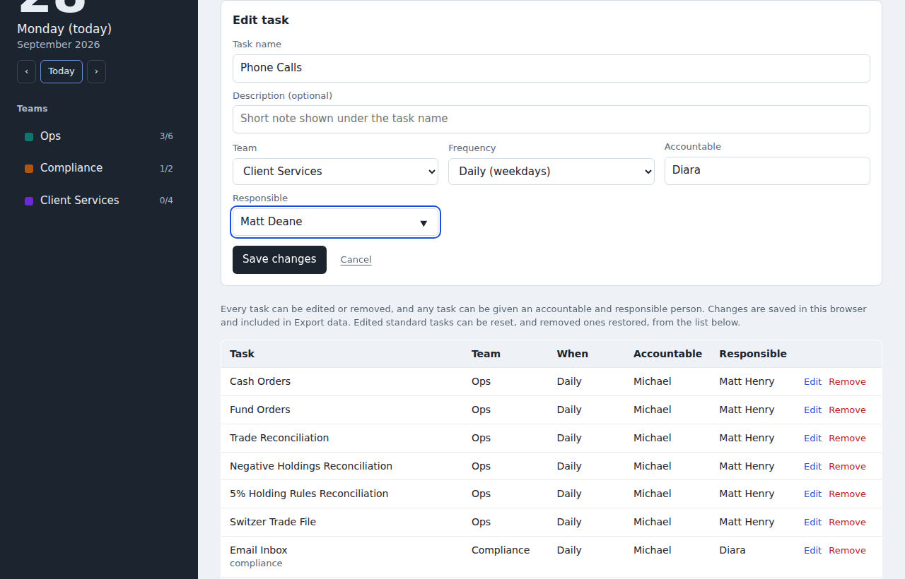
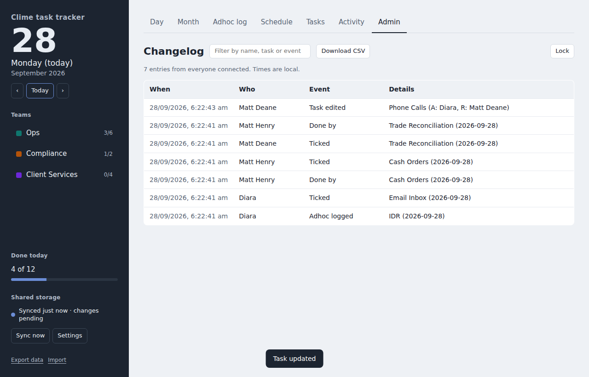

# Clime task tracker: how to fill in the assignment sheet, and what the tool looks like

## Filling in the spreadsheet (Clime_Task_Assignments.xlsx)

1. Open the **Tasks** sheet. Each row is one task. The standard tasks are already listed with the current accountable and responsible people.
2. Fill in the **yellow cells**. For Client Services rows that is the Responsible column. Correct anything else that is wrong: a different day, a different person, a better name.
3. **Frequency** and **Team** are drop-downs (click the cell, then the arrow). **Date / day to be completed by** is a drop-down too: pick a weekday for weekly tasks, 1st, 15th or 30th for monthly, or type something else if none fits. Leave it as "Every weekday" for daily tasks and "As needed" for adhoc.
4. **Accountable** and **Responsible** offer the names already in use. Typing a new name is fine. To make a new name appear in the drop-down, add it under People on the **Lists** sheet.
5. To add a task, use the next blank yellow row: name, team, frequency, day, people. Description is optional.
6. Leave the grey **Tool id** column alone; it is how the tracker matches rows to existing tasks. New rows leave it blank.
7. Save and send the file back. It is loaded into the tracker in one go.

## What the tracker looks like in practice

**Day tab.** The day's checklist. Every task shows its accountable (A) and responsible (R) person. Tick a task and pick your name; it reads "Done by" with a change link. The rail on the left shows progress per team and the shared storage status.

**Month tab.** Weekly, fortnightly and monthly items on a calendar. Click a day to open it. Daily items are not shown on the grid.

**Adhoc log.** Record an IDR, EDR, breach, unlisted transaction or contributory scheme redemption when it comes in, with a date and note. Mark it closed later.

**Schedule tab.** The whole schedule by frequency and team, with the people under each task.

**Tasks tab.** Add a task or edit an existing one, including the accountable and responsible people. This is where the spreadsheet's content ends up.

**Admin tab.** Password protected. The changelog of who ticked, named, added, edited or removed what, and when, with a filter and CSV download.

